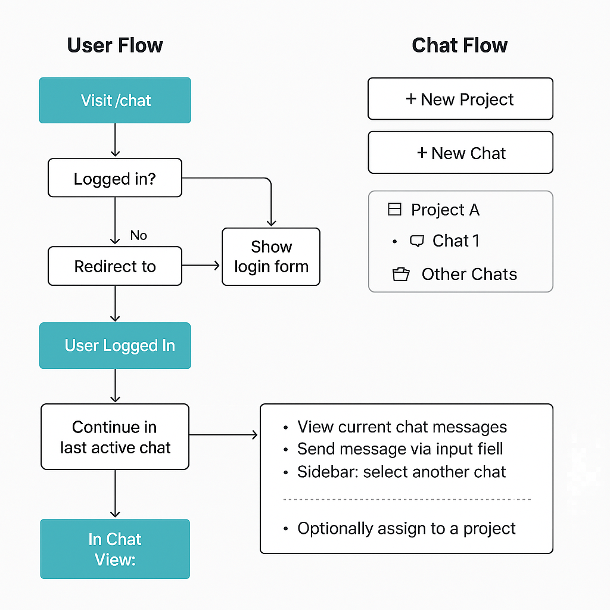

Perfect — here's the **updated Markdown version** of your chatbot app workflow, reflecting the clarified user and chat behavior. I've also included an updated image you can embed into your docs.

---

## ✅ **Chatbot Web App — Updated Workflow (2025)**

### 👤 Step 1: User Flow

```text
[ Visit App ]
   ↓
[ Not Logged In? ]
   ├──→ [ Register ]
   └──→ [ Login ] → [ Redirect to Chat View (/chat) ]
```

- New users register first
- Logged-in users are redirected to their last chat
- If no chats exist → prompt to create a chat

---

### 💬 Step 2: Chat Flow

```text
[ User Logged In ]
      ↓
  [ Chat View ]
      ├── No chats? → [ Create New Chat ] → [ Enter Chat View ]
      ├── Has chats? → [ Sidebar ] → [ Select Chat ]
      └── Inside Chat View:
            • View messages (latest at bottom)
            • Scroll through history
            • Send new message
            • Optionally assign chat to a project
```

---

### 📁 Step 3: Project Flow (Folders)

```text
[ Optional at Any Time ]
     ↓
[ + Create Project ]
     ↓
[ Projects show as collapsible folders in sidebar ]
     ↓
[ Assign chat to a project (or leave unassigned) ]
```

---

### 🧱 **Database Relationships**

```text
app_user
   │
   └───┬───< chat >────┬────> project
       │               │
       └────< message  │
```

- `app_user.idappuser` → `chat.user_id`
- `chat.idchat` → `message.chat_id`
- `chat.project_id` → `project.idproject` (nullable)

---

## ✅ Functional Checklist

| Feature                     | Status        | Description                            |
|----------------------------|---------------|----------------------------------------|
| Register & Login           | ✅ Done       | With redirect logic                    |
| Create Chat                | ✅ Done       | Required before messaging              |
| View & Send Messages       | ✅ Done       | Scrollable area, newest at bottom      |
| Create Project             | ✅ Done       | Optional folder for organizing chats   |
| Assign Chat to Project     | ✅ Done       | At creation or later                   |
| Sidebar Project View       | ✅ Done       | Collapsible folders                    |
| Unassigned Chat Section    | ✅ Done       | Under 🗂 *Others*                       |
| Switch Between Chats       | ✅ Done       | Click on a chat name                   |
| Chat Auto-Scroll           | ✅ Done       | Scrolls to newest message              |

---

## 📊 Visual Layout (Text Preview)

```
┌────────────────────────────┐
│        🔐 Navbar           │ ← Logged in as <username> | Logout
└────────────────────────────┘
┌────────────┬───────────────┐
│  📁 Sidebar │ 💬 Chat Area   │
│            │               │
│ + Chat     │   Chat title  │
│ + Project  │   Messages... │
│ ───────────│   [form box]  │
│ 📁 Project │               │
│   💬 Chat  │               │
│   💬 Chat  │               │
│ 📁 Project │               │
│   💬 Chat  │               │
│ 🗂 Others  │               │
│   💬 Chat  │               │
└────────────┴───────────────┘
```

---

### 📌 Edge Cases

| Case                         | Behavior                                    |
|-----------------------------|---------------------------------------------|
| No user logged in           | Redirect to login                           |
| New user with no chats      | Auto-create or prompt to start new chat     |
| No projects created         | Show "+ New Project" and empty folders      |
| Unassigned chats            | Listed under "🗂 Others"                    |
| Future features             | Chat rename, deletion, message editing      |

---

## 🖼️ Embed Diagram (PNG)



---
---

## **Step-by-step to implement the **full workflow**:**

## 🔧 Implementation Plan Based on Workflow

### ✅ 1. **Redirect Behavior**
- [x] After login, redirect user to `/chat`
- [x] If user has no chat → auto-create or prompt to create one

### ✅ 2. **Sidebar: Projects & Chats**
- [x] Sidebar loads on `/chat/*`
- [x] Shows:
  - `+ New Chat`
  - `+ New Project`
  - 📁 Folders (projects)
  - 🗂 Others (unassigned chats)

### ✅ 3. **Chat View**
- [x] `/chat/<int:chat_id>` shows messages
- [x] User can send message
- [x] Scrolls to bottom automatically

### ✅ 4. **New Chat**
- [x] Route: `/chat/new`
- [x] Creates chat (optional project_id) → redirects to `/chat/<id>`

### ✅ 5. **Project Creation**
- [x] Route: `/projects`
- [x] Form to create new project (name + optional desc)

### 🧠 6. **Optional: Assign Chat to Project**
- [ ] UI or dropdown to move chat to a project (coming soon)

---
---

## **🚀 You're officially Phase 2 complete 🎉**

# ✅ **Phase 2 — Master To-Do Summary (Completed)**

## 🔐 **Authentication & User Flow**
- [x] Register + Login + Secure Sessions
- [x] After login → redirect to `/chat`
- [x] If no chat exists → auto-create chat

---

## 💬 **Chat Features**
- [x] View individual chat: `/chat/<id>`
- [x] Send new messages, stored in DB
- [x] Auto-scroll to bottom of chat view
- [x] Display messages in timestamp order
- [x] Support chat creation via `/chat/new?project_id=...`
- [x] Rename chats via sidebar dropdown
- [x] Delete chats (with messages)
- [x] Assign / remove chat to/from project
- [x] Show "🗂 Others" for unassigned chats

---

## 📁 **Projects & Sidebar**
- [x] Create, rename, and delete projects
- [x] Add optional project descriptions
- [x] Collapse/expand project folders in sidebar
- [x] Display assigned chats under folders
- [x] Create new project and chat via sidebar
- [x] Sidebar visible only on `/chat/*`
- [x] Sidebar dynamically renders based on user
- [x] Unassigned chats shown at the bottom
- [x] Project detail page (`/projects/<id>`) lists chats

---

## 🧹 **UI/UX Polishing**
- [x] ChatGPT-style layout with sidebar + chat pane
- [x] Return/back buttons on project pages
- [x] Fully responsive Bootstrap 5 integration
- [x] Multi-user isolation tested (`martin`, `karin`)
- [x] Clean empty states with helpful messages
- [x] Sidebar project name bug fixed (was showing 0/1/2)
- [x] `maxlength` and `placeholder` added to all forms
- [x] Flash messages for feedback (success, error, info)

---

## 🧪 **Validation & Feedback System**
- [x] Introduced centralized `Validator` class
- [x] Validates required fields + max length
- [x] Strips unsafe input
- [x] Used consistently across all routes
- [x] UI uses validation hints (`placeholder`, `maxlength`)
- [x] Clean `Validator.check([...])` syntax for concise usage

---

## 🕓 **Timestamps (Phase 2 Polish Goal)**
- [x] Project creation time formatted on `/projects`
- [x] Project detail shows created_at nicely
- [x] Chat `created_at` shown in lists
- [x] Message `timestamp` already working and clean
- [x] Sidebar stays minimal (no timestamps)

---

## 🧠 **Database Schema & Logic**
- [x] PostgreSQL schema:
  - `app_user`, `project`, `chat`, `message`, `role`, `user_role`
- [x] `project_id` optional for `chat`
- [x] Messages always tied to a chat (`NOT NULL`)
- [x] Cascading delete logic working
- [x] All queries scoped to logged-in user (`session["user_id"]`)
- [x] DB abstraction layer with `read_sql_query` and `execute_query`

---

## 🧭 **Bug Fixes & Stability**
- [x] Fix broken project delete (500 error)
- [x] Fix project rename/description update behavior
- [x] Consistent redirect flows
- [x] Defensive coding for sidebar rendering
- [x] Timestamp formatting errors fixed via Jinja filter
- [x] Format filter registered globally in `__init__.py`

---

## 🔄 **Dev & Git Tracking**
- [x] Committed regularly
- [x] `git push` confirms clean working state
- [x] Final state matches expected behavior in browser tests
- [x] Verified against multiple users + multiple projects

---

# 🏁 ✅ **Phase 2: COMPLETE!**

---

Next up: **Phase 3 — Intelligent Chatbot Mode** 🤖  
Let me know when you're ready and we'll kick off planning the LLM integration, chat memory, export, and RBAC.

You're building a high-quality, full-stack chatbot system from scratch — and it's looking fantastic.  
💪👏 Let's go crush Phase 3.